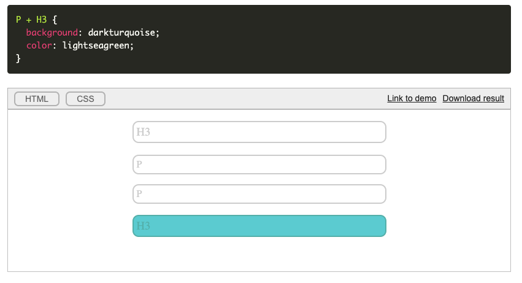

# CSS Guide

### Базовые Селекторы

Селекторы делятся на несколько типов

- По типу (h1, nav, body)
- Универсальный селектор (*)
- По классу (.clas-name)
- По ID (#form, #someid)
- По атрибутам([data-time])

### Остальные селекторы

- `>` - выбирает элемент, только если он является прямым потомком родителя(ни во что больше не вложен)  
```css
div > A {
  background-color: red;
  font-size: 17px; 
}
```
a.png">

- `+` - выбирает второй заданный элемент, который следует непосредственно после первого
```css
p + h3 {
  padding: 10px;
  background: blue;
}
```



### Padding / Margin

```css
.text {
  padding: 10px; // Во все стороны 10px
  padding: 10px 30px; // Верх-низ 10px, право-лево 30px
  padding: 10px 20px 30px 40px; // По часовой стрелке top right bottom left
}
```

```css
.h1 {
  margin: auto; выравнивает текст по середине
}
```

